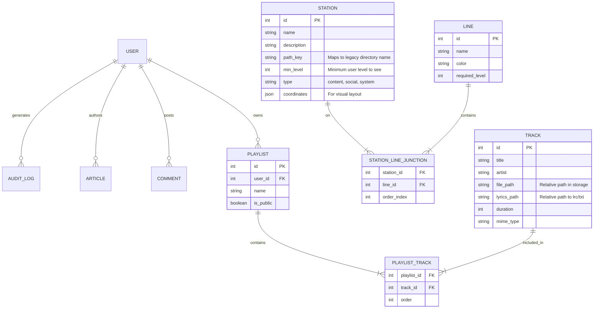

# Data Model: shElter-v3 Integration

## 1. Entity Relationship Diagram (Extended)



## 2. Schema Definitions

### 2.1 Core System (Existing v3 + Updates)

#### User
*   **Existing**: `id`, `email`, `hashed_password`, `is_active`, `is_superuser`.
*   **Add**: `level` (int, default=1) - To support v1's "Rank" system.
*   **Add**: `avatar_url` (string) - To support v1's avatar display.

### 2.2 Metro Map System (New)

The "Metro Map" is the core navigation metaphor from v1.

#### Station (Model)
```python
class Station(Base):
    __tablename__ = "stations"
    
    id = Column(Integer, primary_key=True, index=True)
    name = Column(String, unique=True, index=True)
    description = Column(String, nullable=True)
    path_key = Column(String, unique=True)  # e.g., "01_Cryptonomicon"
    min_level = Column(Integer, default=1)
    is_active = Column(Boolean, default=True)
    meta_data = Column(JSON, default={})  # Store UI coordinates, icon config
```

#### Line (Model)
```python
class Line(Base):
    __tablename__ = "lines"
    
    id = Column(Integer, primary_key=True)
    name = Column(String)  # e.g., "Line 1"
    color = Column(String) # e.g., "#FF0000"
    required_level = Column(Integer, default=1)
```

### 2.3 Music System (New)

Replaces `lyrics_player.php` file scanning with a database-backed catalog.

#### Track (Model)
```python
class Track(Base):
    __tablename__ = "tracks"
    
    id = Column(Integer, primary_key=True)
    title = Column(String, index=True)
    artist = Column(String, nullable=True)
    album = Column(String, nullable=True)
    file_path = Column(String, nullable=False) # Storage path
    cover_image_path = Column(String, nullable=True)
    lyrics_content = Column(Text, nullable=True) # Store lyrics directly or path
    duration = Column(Integer, nullable=True) # Seconds
```

## 3. Migration Strategy (Data Mapping)

### 3.1 Users (v1 Flat File -> v3 DB)
*   **Source**: `c:\BM_Program\shElter-v1\00_shElter\02_SoulLoom\<username>\00_identity.dat`
*   **Target**: `users` table.
*   **Logic**: Iterate all user directories in SoulLoom. Create User entries. Default password to a temporary reset token. Map `02_rank.dat` content to `user.level`.

### 3.2 Metro Stations (v1 Directories -> v3 DB)
*   **Source**: `c:\BM_Program\shElter-v1\00_shElter\` root directories.
*   **Target**: `stations` table.
*   **Logic**:
    *   `01_Cryptonomicon` -> Station(name="Cryptonomicon", path_key="01_Cryptonomicon")
    *   `02_SoulLoom` -> Station(name="SoulLoom", path_key="02_SoulLoom")
    *   `03_Echoom` -> Station(name="Echoom", path_key="03_Echoom")

### 3.3 Music (v1 Files -> v3 DB)
*   **Source**: `c:\BM_Program\shElter-v1\00_shElter\03_Echoom\music`
*   **Target**: `tracks` table.
*   **Logic**: Scan `.mp3`/`.wav` files. Create Track entries. Match with `.txt`/`.lrc` files for lyrics.

## 4. API Response Schemas

### Metro Map Response
```json
{
  "stations": [
    {
      "id": 1,
      "name": "Cryptonomicon",
      "lines": [1, 2],
      "coordinates": {"x": 100, "y": 200},
      "accessible": true
    }
  ],
  "lines": [
    {
      "id": 1,
      "color": "#FF0000",
      "stations": [1, 5, 8]
    }
  ]
}
```
