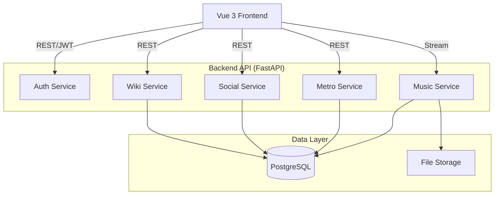

# Implementation Plan: shElter-v3 Integration

## 1. Technology Stack

*   **Backend**: Python 3.11+, FastAPI, SQLAlchemy (Async), Pydantic v2.
*   **Frontend**: Vue 3, Vite, Pinia (State), Vue Router, Tailwind CSS (for layout), Scoped CSS (for v1 visual porting).
*   **Database**: PostgreSQL (Production), SQLite (Dev/Test).
*   **Assets**: MinIO or Local File Storage (for Music/Images).

## 2. Architecture Overview

The system adopts a **Service-Oriented Monolith** architecture. While it runs as a single deployable unit, the domains (Wiki, Social, Metro, Music) are logically separated.

## 3. Component Design (Frontend)

To achieve the "v1 Visuals" requirement, we will create a dedicated `DesignSystem` in Vue that mimics the v1 CSS.

### 3.1 Core Layout
*   **`MetroLayout.vue`**: The main container. Renders the background, the floating navigation (if any), and the router view.
*   **`CRTOverlay.vue`**: A visual effect component to simulate the retro/cyberpunk feel of v1.

### 3.2 Metro Map (Home)
*   **`MetroStationMap.vue`**:
    *   **Responsibility**: Renders the subway lines and stations based on JSON data.
    *   **Implementation**: Use SVG for lines and HTML absolute positioning for Station nodes.
    *   **Interaction**: Click station -> Router push to module.

### 3.3 Music Player (Global)
*   **`RetroPlayer.vue`**:
    *   **Responsibility**: Global persistent footer/overlay. Plays music across page navigations.
    *   **State**: Managed by `usePlayerStore` (Pinia).
    *   **Features**: Lyrics synchronization (v1 feature), Visualizer (Canvas).

### 3.4 Wiki (Cryptonomicon)
*   **`WikiReader.vue`**: Read-only view for articles.
*   **`WikiEditor.vue`**: Markdown/Rich-text editor.

## 4. Backend Service Design

### 4.1 Metro Service (`src/services/metro.py`)
*   `get_map_data(user_level: int)`: Returns filtered stations/lines based on user permission.
*   `check_access(station_id: int, user: User)`: Validates if user can enter a station.

### 4.2 Music Service (`src/services/music.py`)
*   `scan_library()`: Admin task to sync DB with file system.
*   `get_stream_url(track_id: int)`: Secure file serving.
*   `get_lyrics(track_id: int)`: Parses `.lrc` files into JSON `{time: "00:12", text: "..."}`.

### 4.3 Migration Service (`src/services/migration.py`)
*   **One-off scripts** to read v1 data files and populate v3 DB.
*   **Crucial**: Must handle encoding conversion (GBK -> UTF-8) as seen in v1 PHP code.

## 5. Security Considerations

*   **Input Sanitization**: v1 allowed HTML in some places. v3 must sanitize all legacy content using `bleach` or similar library before rendering.
*   **Access Control**: v1 used `userLevel` (1-10). v3 will map this to a `permission_level` integer field in User model.
*   **File Access**: Music files should not be directly accessible via static URL. Use signed URLs or a streaming endpoint with auth check.

## 6. Performance Strategy

*   **Asset Optimization**:
    *   Convert v1 `.wav` files to `.mp3` or `.aac` for web streaming.
    *   Lazy load music player assets only when user interaction occurs.
*   **Caching**:
    *   Cache `MetroMap` data (changes rarely).
    *   Browser caching for static assets.

## 7. Development Phases

1.  **Foundation**: Setup v3 DB schema additions (Metro/Music).
2.  **Migration**: Write scripts to import v1 Users and Content.
3.  **Backend**: Implement Metro and Music APIs.
4.  **Frontend Core**: Implement Metro Map UI and Navigation.
5.  **Frontend Feature**: Implement Music Player and Wiki UI.
6.  **Integration**: Connect all pieces and polish visuals.
